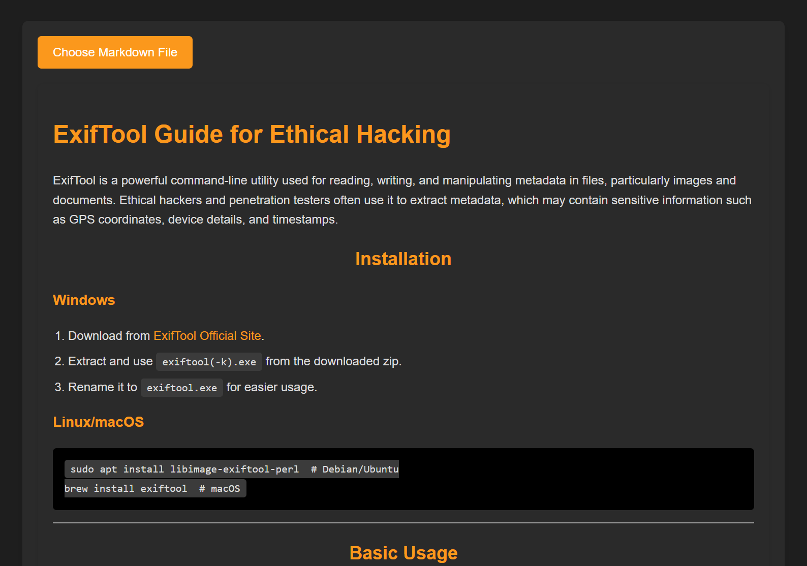

# [Markdown-Viewer][pypi-url]

[pypi-url]: https://github.com/SaaidMohamed/Markdown-Viewer

A simple and efficient Markdown Viewer that allows users to render and preview Markdown files in real-time.

## Features
- 📄 **Real-time Preview** - Instantly see rendered Markdown while editing.
- 🌐 **Web-Based** - Works in the browser without requiring installation.
- 🎨 **Custom Themes** - Supports light and dark mode for better readability.
- ⚡ **Fast & Lightweight** - Uses JavaScript libraries for quick rendering.
- 📂 **File Support** - Open `.md` files from local storage.
- 🔗 **GitHub-Flavored Markdown** - Supports tables, checklists, and code blocks.

## Installation
### Option 1: Clone the Repository
```sh
git clone https://github.com/SaaidMohamed/markdown-viewer.git
cd markdown-viewer
```

### Option 2: Download and Open
1. Download the ZIP from GitHub.
2. Extract the folder and open `index.html` in a browser.

## Usage
1. Open the `index.html` file in your web browser.
2. Paste or write your Markdown text in the editor.
3. Click on 'Choose markdown file' to navigate and select the written .md file.
4. The preview section will automatically update.

## Technologies Used
- **HTML, CSS, JavaScript** - Core web technologies.
- **Marked.js** - Fast Markdown parser and renderer.
- **Prism.js** - Syntax highlighting for code blocks.

## Screenshots


## Contributing
Contributions are welcome! Feel free to submit issues or pull requests.

## License
This project is licensed under the MIT License.

## Author
- **Mohamed Saaid** - [GitHub Profile](https://github.com/SaaidMohamed)
